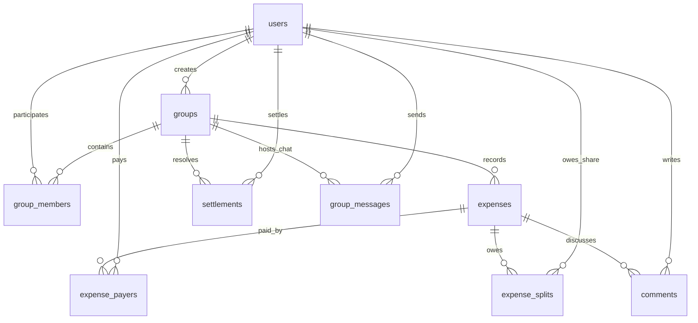

# AI_CONTEXT.md

This document serves as the single source of truth for the Splitwise Clone project. It details the product requirements, engineering architecture, implementation history, and collaborative design alignments that shaped the application.

---

## 1. Product Understanding & Scope

### Product Understanding
* **Core Value Proposition**: A simplified, responsive expense-sharing application designed to track shared bills among group members, dynamically calculate balances, minimize cash flows (simplified debts), and allow real-time comments on individual expenses.
* **Key User Personas**: Co-living roommates, travel groups, and friends sharing joint bills.

### Product Scope
* **In-Scope (MVP)**:
  * **Authentication**: Email-based signup and login with secure sessions.
  * **Group Ledgering**: Creating groups, inviting members by email, and maintaining **time-aware membership** (`joined_at` and `left_at` timestamps) to ensure users are only responsible for expenses logged during their active tenure.
  * **Expense Logging**: Creating, editing, and deleting expenses with support for 4 split algorithms:
    * *Equally*: Costs divided evenly among participants.
    * *Unequally*: Specific currency amounts per person.
    * *Percentage*: Splits defined by percentages (must sum to exactly 100%).
    * *Shares*: Splits calculated using proportional coefficients.
  * **Multi-Currency Support**: Storing original foreign currency amounts and the exchange rate used, while standardizing balances in a base currency (INR).
  * **Debt Simplification**: Applying a greedy minimization algorithm (Min-Cash-Flow) to reduce the transaction count required to clear group balances.
  * **Expense Breakdown Drilldown**: Providing granular views of exactly which expenses contribute to a user's net balance.
  * **Historical Data Import**: Two-phase CSV import tool that detects data anomalies (duplicates, currency mismatches, missing payers, non-members) and allows row-by-row resolution before committing.
  * **Real-time Communication**: Native WebSockets powering both expense-specific comment threads and persistent group-level chat channels.
  * **Manual Settlements**: Recording manual payments between members to bring outstanding balances to zero.
* **Out-of-Scope**:
  * Real payment gateway integrations (Stripe, UPI, PayPal).
  * Receipt scanning/OCR recognition.
  * Recurring/scheduled monthly bills.

---

## 2. Tech Stack & Engineering Requirements

### Tech Stack
* **Backend Framework**: FastAPI (Python 3.11) with Uvicorn.
* **Database & ORM**: PostgreSQL database mapped via SQLAlchemy.
* **Real-time Layer**: Native FastAPI WebSockets.
* **Frontend Library**: React (TypeScript) compiled with Vite.
* **Styling**: TailwindCSS for modular layouts and components.
* **Proxy & Containerization**: Nginx (Alpine) and Docker Compose.

### Engineering & Architectural Requirements
* **Decimal Precision**: All currency operations are calculated and stored with 2 decimal places of precision using PostgreSQL's `NUMERIC(10, 2)` format to prevent floating-point inaccuracies.
* **Rounding Correction**: Fractional rounding remainders (e.g., dividing ₹100.00 among 3 participants leaves a ₹0.01 remainder) are automatically adjusted on the first participant's share to keep ledger totals perfectly aligned.
* **Security**: Password hashing implemented using **bcrypt**. Active sessions are managed via JWT access tokens.
* **Routing**: Client-side single-page routing managed by `react-router-dom` v6.

---

## 3. Database Schema

The database model is mapped via SQLAlchemy to the following PostgreSQL tables:

* **`users`**:
  * `id` (Integer, Primary Key)
  * `email` (String, Unique, Indexed)
  * `password_hash` (String)
  * `name` (String)
  * `created_at` (DateTime)
* **`groups`**:
  * `id` (Integer, Primary Key)
  * `name` (String)
  * `creator_id` (Integer, Foreign Key to `users`)
  * `created_at` (DateTime)
* **`group_members`**:
  * `group_id` (Integer, Foreign Key to `groups`, Primary Key)
  * `user_id` (Integer, Foreign Key to `users`, Primary Key)
  * `joined_at` (DateTime, Nullable)
  * `left_at` (DateTime, Nullable)
* **`expenses`**:
  * `id` (Integer, Primary Key)
  * `group_id` (Integer, Foreign Key to `groups`, Nullable)
  * `description` (String)
  * `amount` (Numeric(10, 2)) - *Always in INR*
  * `currency` (String)
  * `original_amount` (Numeric(10, 4), Nullable)
  * `exchange_rate` (Numeric(10, 6), Nullable)
  * `split_type` (String: `equally`, `unequally`, `percentage`, `shares`)
  * `created_at` (DateTime)
* **`expense_payers`**:
  * `expense_id` (Integer, Foreign Key to `expenses`, Primary Key)
  * `user_id` (Integer, Foreign Key to `users`, Primary Key)
  * `amount_paid` (Numeric(10, 2))
* **`expense_splits`**:
  * `expense_id` (Integer, Foreign Key to `expenses`, Primary Key)
  * `user_id` (Integer, Foreign Key to `users`, Primary Key)
  * `amount_owed` (Numeric(10, 2))
  * `split_value` (Numeric(10, 2), Nullable)
* **`settlements`**:
  * `id` (Integer, Primary Key)
  * `group_id` (Integer, Foreign Key to `groups`, Nullable)
  * `payer_id` (Integer, Foreign Key to `users`)
  * `payee_id` (Integer, Foreign Key to `users`)
  * `amount` (Numeric(10, 2))
  * `created_at` (DateTime)
* **`comments`**:
  * `id` (Integer, Primary Key)
  * `expense_id` (Integer, Foreign Key to `expenses`)
  * `user_id` (Integer, Foreign Key to `users`)
  * `message` (Text)
  * `created_at` (DateTime)
* **`group_messages`**:
  * `id` (Integer, Primary Key)
  * `group_id` (Integer, Foreign Key to `groups`)
  * `user_id` (Integer, Foreign Key to `users`)
  * `message` (Text)
  * `created_at` (DateTime)

---

## 4. API Design & Frontend Structure

### API Design

#### Authentication Endpoints
* `POST /api/auth/register` - Registers a new user.
* `POST /api/auth/login` - Verifies password and returns a JWT access token.
* `GET /api/auth/me` - Fetches the authenticated user profile.

#### Group Endpoints
* `GET /api/groups` - Lists all groups the authenticated user is a member of.
* `POST /api/groups` - Creates a new group.
* `POST /api/groups/{group_id}/members` - Adds a member to a group by email.
* `DELETE /api/groups/{group_id}/members/{user_id}` - Soft-removes a member (sets `left_at`).
* `GET /api/groups/{group_id}/balances` - Computes time-aware members' balances and simplified debts.
* `GET /api/groups/{group_id}/breakdown/{user_id}` - Fetches granular expense breakdown for a specific member's balance.

#### Expense & Settlement Endpoints
* `GET /api/expenses` - Lists expenses (filterable by `group_id`).
* `POST /api/expenses` - Logs an expense (supporting multiple payers and splits).
* `PUT /api/expenses/{expense_id}` - Edits an expense.
* `DELETE /api/expenses/{expense_id}` - Deletes an expense.
* `POST /api/settlements` - Logs a manual payment settlement.
* `GET /api/users/search?q={query}` - Search registered users by email/name.

#### CSV Import Endpoints
* `POST /api/import/preview` - Parses CSV, detects anomalies, and returns a preview report.
* `POST /api/import/commit` - Processes the user-resolved anomaly decisions and inserts approved data.

#### WebSockets Discussion Feeds
* `WS /ws/expenses/{expense_id}/comments?token={JWT}` - Real-time thread for a specific expense.
* `WS /ws/groups/{group_id}/chat?token={JWT}` - Persistent, real-time group-level chat channel.
* `GET /api/groups/{group_id}/messages` - Fetches historical messages for the group chat.

### Frontend Structure
* **Authentication Views**: `/login` (Sign in) and `/register` (Sign up).
* **Main Dashboard**: `/` - Displays net balance summaries, group cards, direct balance lists, and recent settlements.
* **Group Board**: `/groups/:group_id` - Ledger of transactions, list of group members, automated debt simplification, and a modal interface to settle outstanding balances.
* **Modal Forms**: Modals for logging new expenses, adding groups, and opening real-time comment feeds on specific bills.

---

## 5. Deployment & Testing Plan

### Deployment Plan
* **Local Environment**: Orchestrated via Docker Compose containing three services:
  * `frontend`: Vite React app served via an Alpine Nginx proxy.
  * `backend`: FastAPI application.
  * `db`: PostgreSQL instance.
* **Production Deployment**: Automating infrastructure using a Render Blueprint ([render.yaml](file:///e:/Project/Splitwise/render.yaml)) to provision a PostgreSQL database instance, build the FastAPI Docker container, and serve the React static files.

### Testing Plan
* **Integration Testing**: Executed on the backend using `pytest` and `httpx.AsyncClient` to validate authentication access, split algorithms, and balance calculations.
* **Manual Verification**: Performing visual sanity checks on UI responsiveness, modal states, and WebSocket connection handshakes.

---

## 6. Implementation Dialogues (Prompts & AI Responses)

To illustrate the technical alignment, here are key design discussions and collaborative decisions made during development, driven by the user (acting as PM/Senior Developer) and Antigravity AI (acting as Junior Engineer):

### Dialogue 1: Project Scaffolding & AI Role Definition
* **Senior Dev (User)**: "I want to build a shared expenses app from scratch using this tool. I will act as the Product Manager/Senior Developer, and you will be my junior engineer. Let's start with a solid tech stack, modern UI, and comprehensive database architecture."
* **Junior Engineer (Antigravity)**: "Understood! I'll set up the FastAPI backend, PostgreSQL schema, and React/Tailwind frontend. I'll rely on your guidance for product logic, feature prioritization, and architectural decisions."

### Dialogue 2: Handling Messy Historical Data (CSV Import)
* **Senior Dev (User)**: "The group has a messy spreadsheet with inconsistent data — Meera moved out in March, Sam moved in during April, and there are USD expenses mixed with INR. I need an import tool that doesn't just guess numbers. If it's messy, flag it."
* **Junior Engineer (Antigravity)**: "I will design a two-phase import system (Preview → Commit). I'll write heuristics to detect 12 specific anomalies (e.g., duplicate entries, currency mismatches, unknown members). Instead of silently fixing them, the API will surface them in the UI so the user can make an explicit decision (Accept, Skip, Resolve)."

### Dialogue 3: Implementing Time-Aware Balances
* **Senior Dev (User)**: "When calculating balances, we can't include Meera in April's expenses, and we can't include Sam in March's expenses. How do we model this without losing historical data?"
* **Junior Engineer (Antigravity)**: "Initially, I suggested hard-deleting members, but you corrected me. I've now added `joined_at` and `left_at` timestamps to `group_members`. The balance algorithm will filter expenses using the condition `expenses.created_at >= joined_at AND expenses.created_at <= left_at`, perfectly isolating their financial liability."

### Dialogue 4: Granular Transparency
* **Senior Dev (User)**: "Rohan's requirement is 'no magic numbers'. If the app says he owes ₹2,300, he wants a breakdown of exactly what expenses make that up."
* **Junior Engineer (Antigravity)**: "I'll create a new endpoint `/api/groups/{group_id}/breakdown/{user_id}` that traces every single expense the user was involved in during their active membership window. I'll add an expandable UI in the group ledger so members can drill down into their net balance."

---

## 7. Changes Made & Known Limitations

### Architectural Evolutions
* **Schema Evolution via Migrations**: Transitioned from a static schema to an evolving one via `migrate.py`. Added `currency`, `original_amount`, `exchange_rate` to Expenses, and `joined_at`, `left_at` to Group Members.
* **Time-Aware Memberships**: Shifted from hard-deletes to soft-deletes for group members. This preserves the historical accuracy of past expenses while correctly omitting inactive users from future splits.
* **Two-Phase CSV Import Engine**: Built a robust React workflow (`ImportCSVModal`) that parses raw data, presents categorized anomalies, and executes user-approved corrections.
* **Full-Featured Communication**: Expanded WebSockets from simple expense-level comments to a persistent, group-level chat panel with date separators, avatars, and history synchronization.
* **Password Visibility Toggle**: Integrated an eye toggle visibility button (`Eye` / `EyeOff` from `lucide-react`) in the login and registration credentials form fields, improving user experience.

### Trade-offs & Known Limitations
* **Single Baseline Currency**: While original USD amounts are preserved, the actual ledger math operates exclusively in INR using a fixed exchange rate at the time of entry/import.
* **No Real-world Payments**: Settlements are logical entries recorded to clear balances inside the application; no payment gateway API is wired.
* **Local State Over Redux**: Chose React Hook Context over Redux or Zustand. While it keeps code footprints small, it requires full re-fetches upon group detail updates to sync balance updates.
* **Group-centric Debt Simplification**: Debt simplification operates within the local group scope; it does not calculate inter-group credit offsets.
