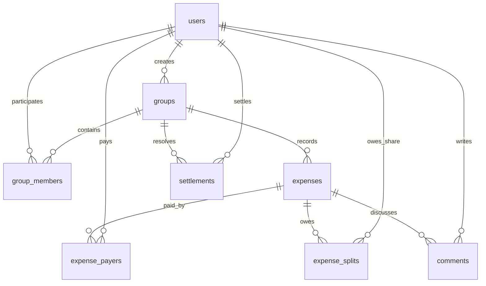

# AI_CONTEXT.md

This document serves as the single source of truth for the Splitwise Clone project. It details the product requirements, engineering architecture, implementation history, and collaborative design alignments that shaped the application.

---

## 1. Product Understanding & Scope

### Product Understanding
* **Core Value Proposition**: A simplified, responsive expense-sharing application designed to track shared bills among group members, dynamically calculate balances, minimize cash flows (simplified debts), and allow real-time comments on individual expenses.
* **Key User Personas**: Co-living roommates, travel groups, and friends sharing joint bills.

### Product Scope
* **In-Scope (MVP)**:
  * **Authentication**: Email-based signup and login with secure sessions.
  * **Group Ledgering**: Creating groups and inviting members by email. The group creator holds admin privileges to remove members.
  * **Expense Logging**: Creating, editing, and deleting expenses with support for 4 split algorithms:
    * *Equally*: Costs divided evenly among participants.
    * *Unequally*: Specific currency amounts per person.
    * *Percentage*: Splits defined by percentages (must sum to exactly 100%).
    * *Shares*: Splits calculated using proportional coefficients.
  * **Debt Simplification**: Applying a greedy minimization algorithm (Min-Cash-Flow) to reduce the transaction count required to clear group balances.
  * **Real-time Chat**: Native WebSockets allowing group members to comment on specific bills in real time.
  * **Manual Settlements**: Recording manual payments between members to bring outstanding balances to zero.
* **Out-of-Scope**:
  * Real payment gateway integrations (Stripe, UPI, PayPal).
  * Native multi-currency ledgering (standardized on a single baseline currency, INR, to avoid exchange rate volatility).
  * Receipt scanning/OCR recognition.
  * Recurring/scheduled monthly bills.

---

## 2. Tech Stack & Engineering Requirements

### Tech Stack
* **Backend Framework**: FastAPI (Python 3.11) with Uvicorn.
* **Database & ORM**: PostgreSQL database mapped via SQLAlchemy.
* **Real-time Layer**: Native FastAPI WebSockets.
* **Frontend Library**: React (TypeScript) compiled with Vite.
* **Styling**: TailwindCSS for modular layouts and components.
* **Proxy & Containerization**: Nginx (Alpine) and Docker Compose.

### Engineering & Architectural Requirements
* **Decimal Precision**: All currency operations are calculated and stored with 2 decimal places of precision using PostgreSQL's `NUMERIC(10, 2)` format to prevent floating-point inaccuracies.
* **Rounding Correction**: Fractional rounding remainders (e.g., dividing ₹100.00 among 3 participants leaves a ₹0.01 remainder) are automatically adjusted on the first participant's share to keep ledger totals perfectly aligned.
* **Security**: Password hashing implemented using **bcrypt**. Active sessions are managed via JWT access tokens.
* **Routing**: Client-side single-page routing managed by `react-router-dom` v6.

---

## 3. Database Schema

The database model is mapped via SQLAlchemy to the following PostgreSQL tables:

* **`users`**:
  * `id` (Integer, Primary Key)
  * `email` (String, Unique, Indexed)
  * `password_hash` (String)
  * `name` (String)
  * `created_at` (DateTime)
* **`groups`**:
  * `id` (Integer, Primary Key)
  * `name` (String)
  * `creator_id` (Integer, Foreign Key to `users`)
  * `created_at` (DateTime)
* **`group_members`**:
  * `group_id` (Integer, Foreign Key to `groups`, Primary Key)
  * `user_id` (Integer, Foreign Key to `users`, Primary Key)
* **`expenses`**:
  * `id` (Integer, Primary Key)
  * `group_id` (Integer, Foreign Key to `groups`, Nullable)
  * `description` (String)
  * `amount` (Numeric(10, 2))
  * `split_type` (String: `equally`, `unequally`, `percentage`, `shares`)
  * `created_at` (DateTime)
* **`expense_payers`**:
  * `expense_id` (Integer, Foreign Key to `expenses`, Primary Key)
  * `user_id` (Integer, Foreign Key to `users`, Primary Key)
  * `amount_paid` (Numeric(10, 2))
* **`expense_splits`**:
  * `expense_id` (Integer, Foreign Key to `expenses`, Primary Key)
  * `user_id` (Integer, Foreign Key to `users`, Primary Key)
  * `amount_owed` (Numeric(10, 2))
  * `split_value` (Numeric(10, 2), Nullable)
* **`settlements`**:
  * `id` (Integer, Primary Key)
  * `group_id` (Integer, Foreign Key to `groups`, Nullable)
  * `payer_id` (Integer, Foreign Key to `users`)
  * `payee_id` (Integer, Foreign Key to `users`)
  * `amount` (Numeric(10, 2))
  * `created_at` (DateTime)
* **`comments`**:
  * `id` (Integer, Primary Key)
  * `expense_id` (Integer, Foreign Key to `expenses`)
  * `user_id` (Integer, Foreign Key to `users`)
  * `message` (Text)
  * `created_at` (DateTime)

---

## 4. API Design & Frontend Structure

### API Design

#### Authentication Endpoints
* `POST /api/auth/register` - Registers a new user.
* `POST /api/auth/login` - Verifies password and returns a JWT access token.
* `GET /api/auth/me` - Fetches the authenticated user profile.

#### Group Endpoints
* `GET /api/groups` - Lists all groups the authenticated user is a member of.
* `POST /api/groups` - Creates a new group.
* `POST /api/groups/{group_id}/members` - Adds a member to a group by email.
* `DELETE /api/groups/{group_id}/members/{user_id}` - Removes a member (admin-only).
* `GET /api/groups/{group_id}/balances` - Computes members' balances and simplified debts.

#### Expense & Settlement Endpoints
* `GET /api/expenses` - Lists expenses (filterable by `group_id`).
* `POST /api/expenses` - Logs an expense (supporting multiple payers and splits).
* `PUT /api/expenses/{expense_id}` - Edits an expense.
* `DELETE /api/expenses/{expense_id}` - Deletes an expense.
* `POST /api/settlements` - Logs a manual payment settlement.
* `GET /api/users/search?q={query}` - Search registered users by email/name.

#### WebSockets Discussion Feed
* `WS /ws/expenses/{expense_id}/comments?token={JWT}` - Establishes real-time chat. Comments are persisted to `comments` and broadcasted to active connections in the room.

### Frontend Structure
* **Authentication Views**: `/login` (Sign in) and `/register` (Sign up).
* **Main Dashboard**: `/` - Displays net balance summaries, group cards, direct balance lists, and recent settlements.
* **Group Board**: `/groups/:group_id` - Ledger of transactions, list of group members, automated debt simplification, and a modal interface to settle outstanding balances.
* **Modal Forms**: Modals for logging new expenses, adding groups, and opening real-time comment feeds on specific bills.

---

## 5. Deployment & Testing Plan

### Deployment Plan
* **Local Environment**: Orchestrated via Docker Compose containing three services:
  * `frontend`: Vite React app served via an Alpine Nginx proxy.
  * `backend`: FastAPI application.
  * `db`: PostgreSQL instance.
* **Production Deployment**: Automating infrastructure using a Render Blueprint ([render.yaml](file:///e:/Project/Splitwise/render.yaml)) to provision a PostgreSQL database instance, build the FastAPI Docker container, and serve the React static files.

### Testing Plan
* **Integration Testing**: Executed on the backend using `pytest` and `httpx.AsyncClient` to validate authentication access, split algorithms, and balance calculations.
* **Manual Verification**: Performing visual sanity checks on UI responsiveness, modal states, and WebSocket connection handshakes.

---

## 6. Implementation Dialogues (Prompts & AI Responses)

To illustrate the technical alignment, here are key design discussions and collaborative decisions made during development:

### Dialogue 1: Core Architecture & Styling Realignment
* **Developer Alignment**: "Let's align on the styling and layout for the clone. We want to use TailwindCSS for layout design, applying light geometric repeating grid elements on the background and displaying genuine, colored vector illustrations on the landing page matching the original branding color codes."
* **System Design Response**: "I will structure the components to load custom CSS backgrounds and map paths for SVG polygon vectors, applying exact CSS hex codes extracted from standard style sheets. The frontend context will manage state via standard React Hook Contexts to keep the application lightweight."

### Dialogue 2: Database Initialization & Seeding Strategy
* **Developer Alignment**: "We need to set up a comprehensive test dataset representing a flat's shared expenses and a vacation ledger. Let's create accounts for all roommates (Aisha, Priya, Rohan, Dev, Meera, Sam, Kabir) with standard test credentials, add them to a single group, and seed all transactions chronologically from our transaction history spreadsheet."
* **System Design Response**: "I will create a database seeding script `seed_data.py` that wipes the existing schema for a clean slate, registers all 7 users, adds them to a new group 'Flatmates & Friends', and inserts the transactions. I will implement automated conversion for USD entries to INR at a baseline rate of 83.0 and normalize the percentage splits to sum to exactly 100.00% to pass API validations."

---

## 7. Changes Made & Known Limitations

### Changes Made During Implementation
* **Dynamic Seeding System**: Wrote and executed a database seeding system to populate the database with a chronicled ledger of 42 transactions, translating standard splits, unequal splits, percentages, and shares into correct database rows.
* **Multi-Payer Equal Division**: Structured the *House cleaning supplies* payment to divide the payment obligation equally among all roommates when the payer was unspecified, preventing ledger discrepancies.
* **Exchange Conversion Integration**: Added inline USD-to-INR conversions for Goa trip expenses to keep balance aggregation mathematically accurate.
* **Percentage Normalization**: Adjusted percentages for *Pizza Friday* and *Weekend brunch* to exactly 27.27% (Aisha/Rohan/Priya) and 18.19% (Meera) to solve the 110% overflow error.

### Trade-offs & Known Limitations
* **Single Currency Boundary**: The system operates entirely in a single baseline currency (rendered as Rupee ₹). Transactions entered in USD are converted at seed time; there is no dynamic runtime exchange rate module.
* **No Real-world Payments**: Settlements are logical entries recorded to clear balances inside the application; no payment gateway API is wired.
* **Local State Over Redux**: Chose React Hook Context over Redux or Zustand. While it keeps code footprints small, it requires full re-fetches upon group detail updates to sync balance updates.
* **Group-centric Debt Simplification**: Debt simplification operates within the local group scope; it does not calculate inter-group credit offsets.
